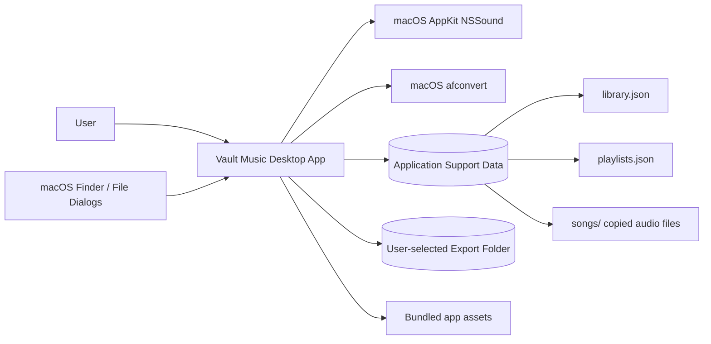
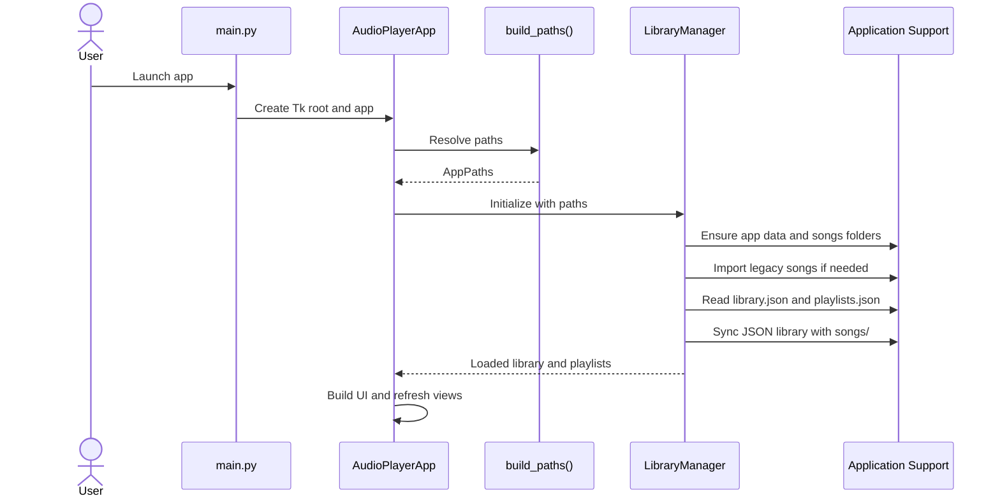
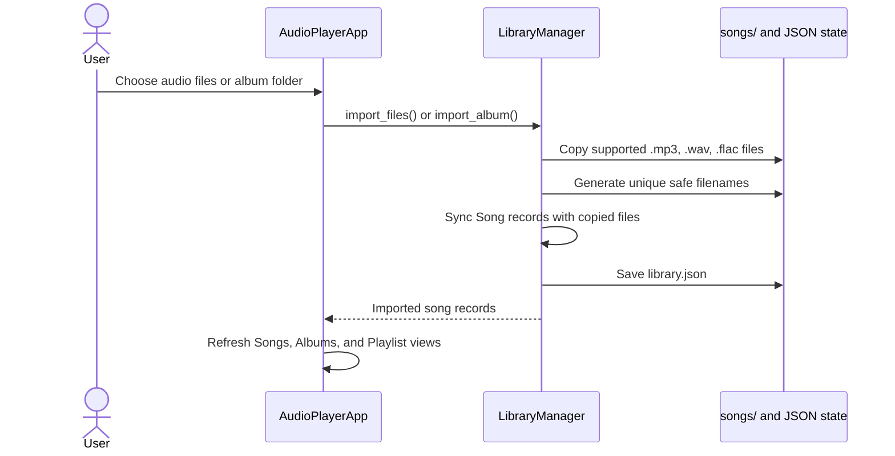
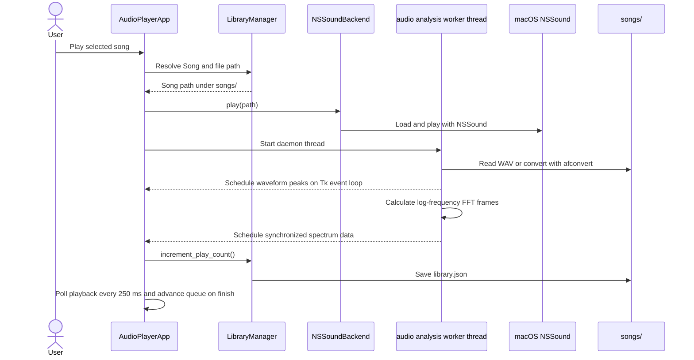
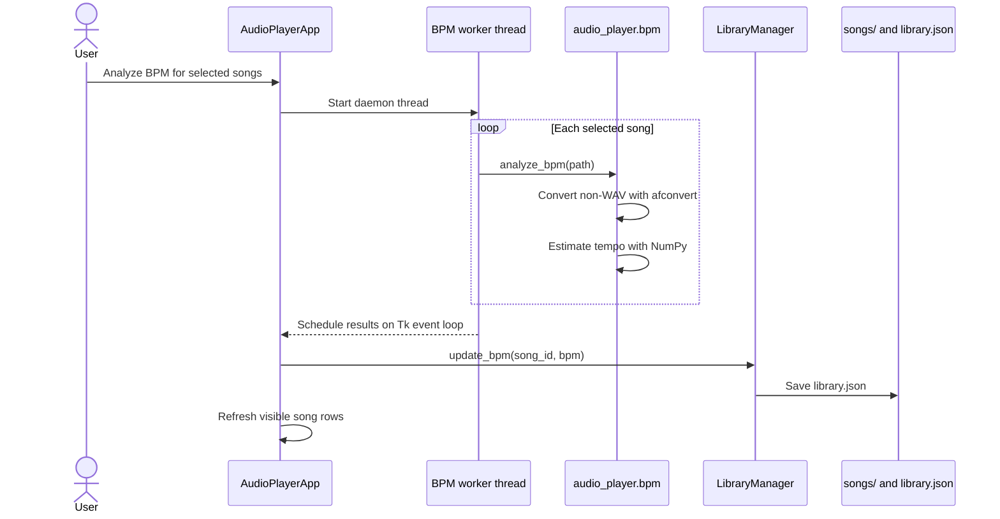
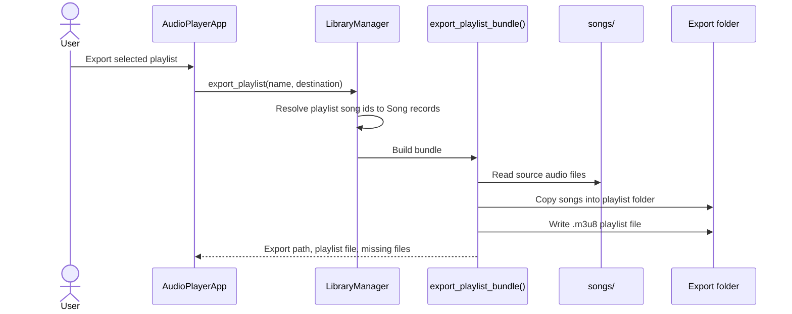
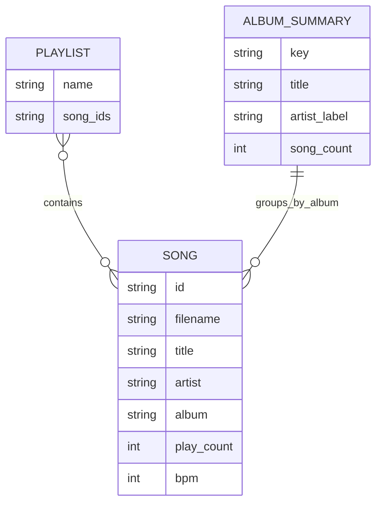

# Vault Music System Architecture

Vault Music is a local-first macOS desktop audio-library app. The application is a single Python process with a Tkinter UI, a local JSON-backed library, copied audio files in Application Support, and macOS-native playback through `NSSound`.

## System Context



## Component Architecture

```mermaid
flowchart TD
    main[main.py<br/>Process entry point] --> ui[AudioPlayerApp<br/>audio_player.app]

    subgraph UI["Tkinter Desktop UI"]
        ui --> songsview[Songs view]
        ui --> albumsview[Albums view]
        ui --> playlistview[Playlist sidebar]
        ui --> transport[Transport controls]
        ui --> waveformcanvas[Waveform canvas]
        ui --> spectrumcanvas[Spectrum analyser canvas]
    end

    subgraph Domain["Application Domain"]
        library[LibraryManager<br/>audio_player.library]
        models[Song and AlbumSummary<br/>audio_player.models]
        exporter[Playlist bundle exporter<br/>audio_player.exporter]
        utils[Formatting and path helpers<br/>audio_player.utils]
    end

    subgraph Services["Platform / Analysis Services"]
        playback[NSSoundBackend<br/>audio_player.playback]
        waveform[Waveform peak builder<br/>audio_player.waveform]
        spectral[Spectrum FFT builder<br/>audio_player.spectral]
        bpm[BPM analyzer<br/>audio_player.bpm]
        config[Path builder<br/>audio_player.config]
    end

    subgraph Storage["Local Storage"]
        appdata[(~/Library/Application Support/AudioPlayer<br/>or AUDIOPLAYER_DATA_DIR)]
        songs[(songs/)]
        librarydb[(library.json)]
        playlistdb[(playlists.json)]
        legacy[(legacy songs/ and playlists/)]
    end

    subgraph External["External Dependencies"]
        nssound[macOS AppKit NSSound]
        afconvert[/usr/bin/afconvert]
        numpy[NumPy]
        pyobjc[PyObjC Cocoa bridge]
    end

    ui --> library
    ui --> playback
    ui --> waveform
    ui --> spectral
    ui --> bpm
    ui --> config
    ui --> assets[assets/app_icon.*]

    library --> models
    library --> exporter
    library --> utils
    library --> appdata
    library --> songs
    library --> librarydb
    library --> playlistdb
    library --> legacy

    exporter --> utils
    exporter --> songs
    exporter --> exportdir[(Export playlist folder)]

    config --> appdata
    playback --> nssound
    playback --> pyobjc
    waveform --> afconvert
    spectral --> afconvert
    spectral --> numpy
    bpm --> afconvert
    bpm --> numpy
```

## Runtime Flows

### Startup And State Sync



### Import Songs Or Albums



### Playback And Waveform



### BPM Analysis



### Playlist Export



## Data Model



## Storage Layout

```text
~/Library/Application Support/AudioPlayer/
  library.json       # serialized Song records
  playlists.json     # playlist name -> ordered song id list
  songs/             # copied local audio files used by the app
```

`AUDIOPLAYER_DATA_DIR` can override the Application Support directory for development and testing.

## Key Responsibilities

| Module | Responsibility |
| --- | --- |
| `main.py` | Starts the Tkinter application. |
| `audio_player.app` | Owns UI state, event handling, queue behavior, playback polling, drag/drop interactions, and worker-thread result dispatch. |
| `audio_player.config` | Resolves app data paths, supported file extensions, legacy paths, and icon candidates. |
| `audio_player.library` | Imports files, synchronizes disk state, manages songs/albums/playlists, persists JSON, and delegates playlist export. |
| `audio_player.models` | Defines `Song` and `AlbumSummary` data structures. |
| `audio_player.playback` | Wraps macOS `NSSound` playback, pause/resume, stop, seek, duration, and completion detection. |
| `audio_player.waveform` | Produces normalized waveform peaks from WAV data and converts non-WAV files with `afconvert`. |
| `audio_player.spectral` | Produces normalized log-frequency FFT frames for the synchronized spectrum analyser. |
| `audio_player.bpm` | Estimates BPM using PCM analysis and NumPy, with `afconvert` conversion for non-WAV files. |
| `audio_player.exporter` | Copies playlist audio files and writes portable `.m3u8` playlist bundles. |
| `audio_player.utils` | Provides sanitization, unique path generation, song labels, and time formatting. |

## Deployment Shape

The app runs from source with `python main.py` or can be packaged as a macOS app bundle using `pyinstaller "Vault Music.spec"`. Runtime data remains outside the bundle in the configured Application Support directory.
