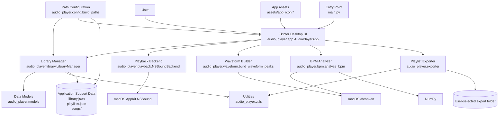

# Architecture

## Runtime Flow

1. `main.py` starts the Tkinter desktop app.
2. `AudioPlayerApp` builds the interface and coordinates user actions.
3. `LibraryManager` loads and saves local library state under `~/Library/Application Support/AudioPlayer` unless `AUDIOPLAYER_DATA_DIR` is set.
4. Playback is delegated to macOS `NSSound` through `NSSoundBackend`.
5. Waveform and BPM helpers convert non-WAV audio with macOS `afconvert`; BPM estimation also uses NumPy.
6. Playlist exports copy selected audio files and write playlist metadata to a user-selected folder.
